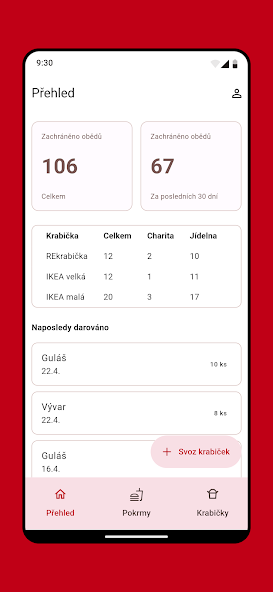
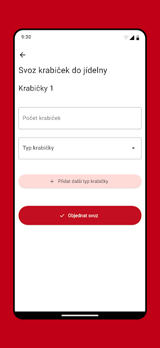
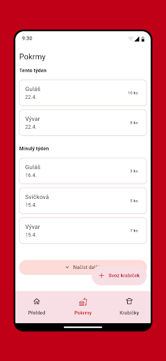

# Zachraň oběd

## 📝 Description

Zachraň oběd is a non-profit platform that connects canteens, restaurants and other food providers with charities and shelters to donate surplus cooked meals that would otherwise go to waste.

The goal is to prevent food waste by redistributing safe, freshly prepared meals to people in need. The platform ensures compliance with hygiene and legal standards and supports both public institutions (like school cafeterias or hospitals) and private donors.

Key Highlights:

♻️ Rescues cooked meals that are safe to eat.

🏥 Works with schools, hospitals, corporate and public canteens.

🤝 Meals are picked up by recipient organizations or delivered by partners like DODO.

📱 Available as a mobile app (Android and iOS) and web platform.

💡 Over 50 000 meals saved across the Czech Republic.

Learn more at https://zachranobed.cz.

## 📸 Screenshots





## ✔️ Features

- ✅ Firebase Authentication (email/password).
- ✅ Firestore for donations and pickup management.
- ✅ Firebase Cloud Functions for scheduled maintenance.
- ✅ Localized UI via Flutter's localization tooling.
- ✅ Multi-platform support: Android, iOS and Web.

## 🗂️ Project Structure

```
├── lib/                        # App features and logic
│   ├── main.dart               # App entry point
│   └── l10n/app_cs.arb         # Localization file
├── android/                    # Android project
├── ios/                        # iOS project
├── web/                        # Web project
├── functions/                  # Firebase Cloud Functions (Node.js)
├── cron/scripts/               # Scheduled scripts
├── .github/                    # Github actions for CI/CD
└── pubspec.yaml                # Flutter metadata and dependencies
```

## 📦 Key Dependencies

Listed in `pubspec.yaml`:

- `firebase_core` – Initialize Firebase
- `firebase_auth` – Handle authentication
- `cloud_firestore` – Real-time database
- `firebase_functions` – Call cloud functions from Flutter
- `flutter_local_notifications` – For local notifications
- `intl` & `flutter_localizations` – Localization support

## 🛠 CI/CD (GitHub Actions)

The project uses GitHub Actions for CI/CD to automatically build and deliver new versions of mobile apps to Firebase App Distribution and deploy new version of the web. Environment variables and secrets (e.g., Firebase tokens) are stored securely using **GitHub Secrets**.

## 📞 Contact & Acknowledgements

**Maintainers**: [zachran-jidlo](https://github.com/zachran-jidlo)  
**Repo**: [github.com/zachran-jidlo/zachranobed](https://github.com/zachran-jidlo/zachranobed)

Built with 💙 using [Flutter](https://flutter.dev) and [Firebase](https://firebase.google.com).

---

*README updated on July 3, 2025.*
